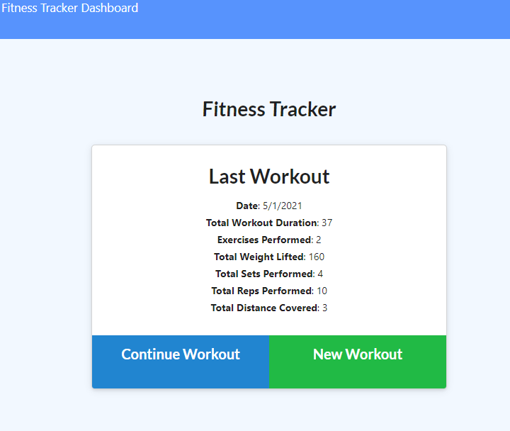
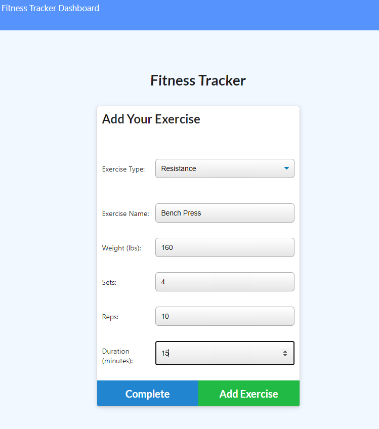
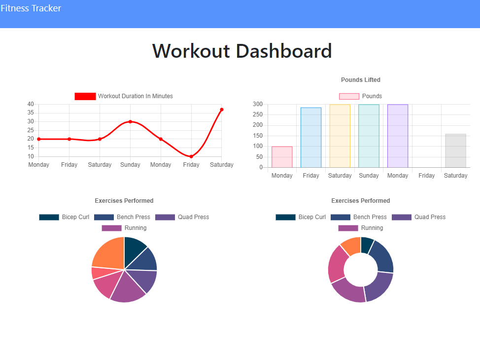

# The Fitness Tracker

  ## Description

  This is a full stack application built to help normal human beings track their fitness. Every human should have access to resources that can help them stay physically fit, this application provides a way from people to track their day to day workouts. Anyone can use this to input exercises to their daily regimen and track their fitness over the course of the last 7 workouts.

  ## Table of Contents

  * [Installation](#installation)
  * [Usage](#usage)
  * [License](#license)
  * [Contributors](#contributors)
  * [Questions](#questions?)
  * [Tests](#tests)

  ## Installation

  Go to the [deployed app](https://ancient-atoll-51015.herokuapp.com/)

  ## Usage

  When you are on the application you will have the options to continue workout or create new workout. Regardless of which option you choose, the application will have you enter in a new cardio or resistance exercise. You can then choose to add the exercise and complete the workout or you can add the exercise and create a new exercise to add. Once you have 7 workouts worth of data you can then go to the dashboard and check your progress over the last 7 workouts.

  

  
  
  

  ## License

  

  ## Contributors

  N/A

  ## Questions?
  Follow me on Github
  [wmccone](https://github.com/wmccone) 
  or 
  email me at gerrymccone88@gmail.com

  ## Tests

  N/A

